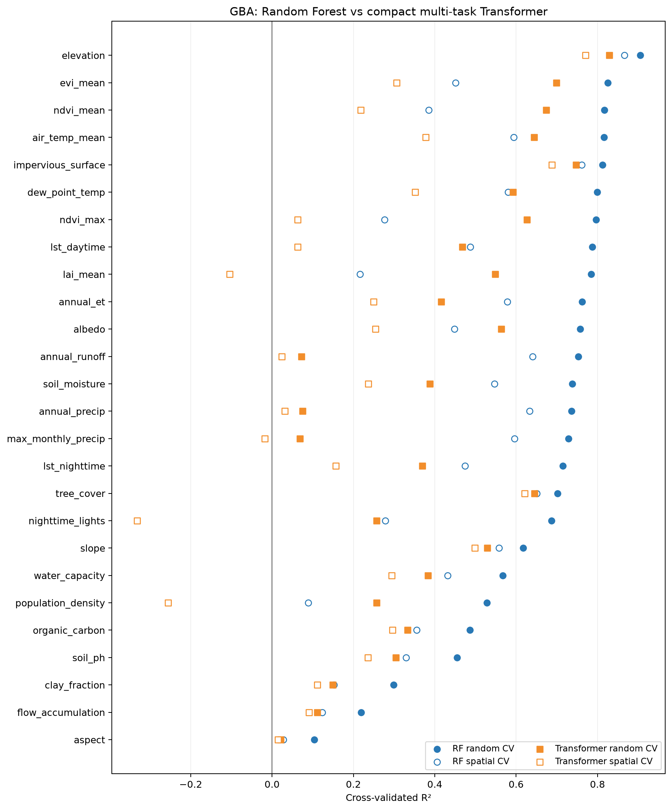
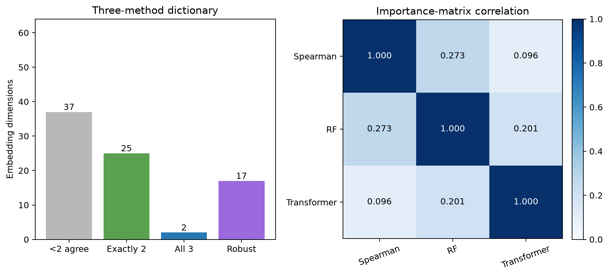
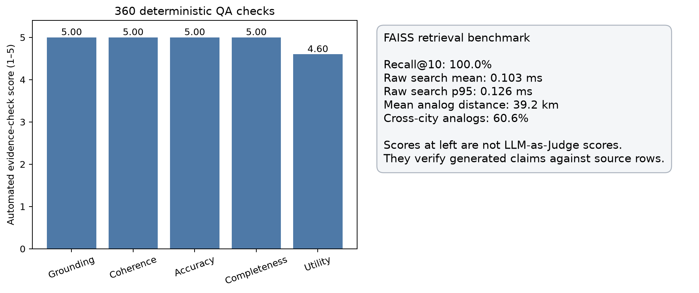

# AlphaEarth 大湾区扩展复现：四个后续模块

## 总结

四个后续模块已经形成可重复运行的实现：紧凑型多任务 Transformer、Spearman/RF/Transformer 三方法维度字典、54,614 向量的 FAISS/RAG 系统，以及 360 次真实位置问答的证据一致性评测。真正的四模型 LLM-as-Judge 调用器也已实现，但由于当前环境没有模型 API 凭据，尚未产生四模型评分；当前 **4.92/5** 仅代表确定性证据检查，不能与原论文的 **3.74/5** 直接比较。

## 1. 多任务 Transformer

- 数据：严格口径大湾区真实数据，每折从 54,614 行中固定抽样 30,000 行。
- 模型：64 个带维度标识的数值 token，2 层、4 头、`d_model=32`，一次预测 26 个目标。
- 验证：5 折随机 CV 与 0.5° 空间分块 CV。
- 重要性：在留出集逐维置换，而不是把注意力权重直接解释为因果重要性。
- 运行设备：Apple MPS；正式训练耗时 7.5 分钟。

| 指标 | 原论文 | 大湾区 RF | 大湾区 Transformer |
|---|---:|---:|---:|
| 平均随机 CV R² | 未统一报告 | 0.662 | 0.414 |
| 平均空间 CV R² | 未统一报告 | 0.443 | 0.202 |
| 平均空间 ΔR² | Transformer 0.017 | 0.218 | 0.213 |
| 随机 R² > 0.7 | — | 17/26 | 2/26 |

Transformer 的平均随机 R² 为 **0.414**，低于 RF 的 **0.662**；平均空间下降 **0.213**，与 RF 的 **0.218** 接近。这是缩小数据与模型下的真实结果，不支持“Transformer 必然优于随机森林”。

### Transformer表现最好的变量

| 变量 | 随机R² | 空间R² | ΔR² |
|---|---:|---:|---:|
| elevation | 0.829 | 0.770 | 0.059 |
| impervious_surface | 0.747 | 0.688 | 0.059 |
| evi_mean | 0.699 | 0.307 | 0.392 |
| ndvi_mean | 0.674 | 0.218 | 0.456 |
| tree_cover | 0.645 | 0.621 | 0.024 |
| air_temp_mean | 0.644 | 0.378 | 0.266 |
| ndvi_max | 0.627 | 0.063 | 0.564 |
| dew_point_temp | 0.592 | 0.352 | 0.240 |
| albedo | 0.563 | 0.254 | 0.309 |
| lai_mean | 0.548 | -0.104 | 0.652 |

## 2. 三方法维度字典

- 至少两种方法一致：**27/64**。
- 三种方法完全一致：**2/64**。
- 同时满足时间稳定性 `r >= 0.90` 的稳健维度：**17/64**。
- 重要性矩阵相关：Spearman–RF **0.273**，Spearman–Transformer **0.096**，RF–Transformer **0.201**。

| 维度 | 主要变量 | Spearman ρ | 一致方法数 | 时间稳定性 |
|---|---|---:|---:|---:|
| A08 | elevation | 0.869 | 2 | 0.971 |
| A04 | air_temp_mean | -0.644 | 2 | 0.909 |
| A58 | nighttime_lights | 0.488 | 3 | 0.963 |
| A27 | soil_moisture | -0.477 | 2 | 0.902 |
| A31 | organic_carbon | 0.582 | 2 | 0.983 |
| A13 | annual_runoff | -0.358 | 2 | 0.968 |
| A19 | elevation | -0.720 | 2 | 0.944 |
| A29 | flow_accumulation | -0.186 | 2 | 0.945 |
| A02 | organic_carbon | -0.554 | 2 | 0.958 |
| A52 | impervious_surface | -0.737 | 2 | 0.966 |

完整字典同时提供 JSON、按维度 CSV 和按变量 CSV。无两方法一致的维度仍会保留，但只标记为探索性解释。

## 3. FAISS 与 RAG 原型

- 索引：`IndexIVFFlat`，54,614 个 64 维年度向量。
- 参数：`nlist=233`，`nprobe=64`，余弦相似度。
- 检索时排除同一 `point_id`，防止同地点不同年份制造虚假的相似结果。
- 36 个评测位置上 Recall@10 为 **100.0%**，原始 FAISS 搜索平均 **0.103 ms**。
- 返回相似地点平均距离 **39.2 km**，其中 **60.6%** 来自其他城市。

RAG回答包含：位置解析、真实环境画像、区域百分位、相关AlphaEarth维度、相似地点及方法限制。当前采用确定性证据渲染，优点是每个数值都可追溯；它不是开放式大语言模型生成。

## 4. 360次问答评测

- 36 个分层抽取的真实位置 × 10 类意图 = **360** 次。
- 数值证据回查准确率：**100.0%**。
- 完整RAG回答平均延迟：**1.47 ms**。
- 确定性证据检查总体分：**4.92/5**。

该评分回答的是“系统有没有忠实呈现检索到的数据”，没有回答“开放式LLM的语言、推理和建议是否达到专家水平”。因此它不能与论文四模型 LLM-as-Judge 的 3.74 分作优劣比较。

## 与原论文仍不完全相同的地方

1. Transformer 训练数据为 30,000 行、2层4头；原论文约500万行、4层8头、60轮。
2. 大湾区空间验证使用0.5°块；论文在CONUS使用2°块。
3. PRISM和NLCD不覆盖中国，仍由ERA5-Land和WorldCover替代。
4. 当前执行的是确定性证据评测；四模型轮换评审脚本已准备，但没有API凭据，所以未调用外部模型。
5. 没有人工环境领域专家评分。该项也是原论文承认的限制，可作为后续增强。

## 主要文件

- `transformer_results.json`：Transformer逐变量、逐折结果及64×26置换重要性。
- `gba_transformer.pt`：第一随机折最佳模型与标准化参数。
- `dimension_dictionary.json/csv`：三方法维度知识库。
- `lsi/manifest.json`、`lsi/gba_aef_ivfflat.faiss`：检索索引与参数。
- `lsi/demo_answers.md`：三类实际问答示例。
- `lsi/evaluation/evaluation_summary.json`：360次证据评测汇总。
- `lsi/evaluation/answers.jsonl`：全部问题、答案、证据与检索结果。
- `src/run_gba_llm_judge.py`：可恢复、四模型轮换的真正LLM评审接口。
