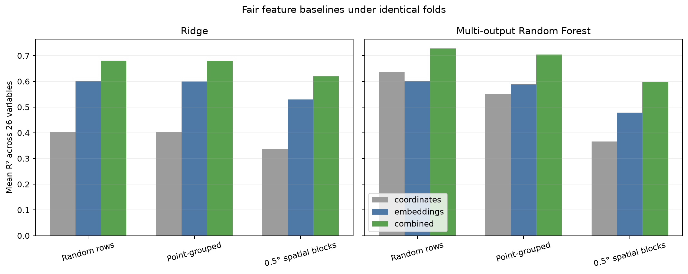
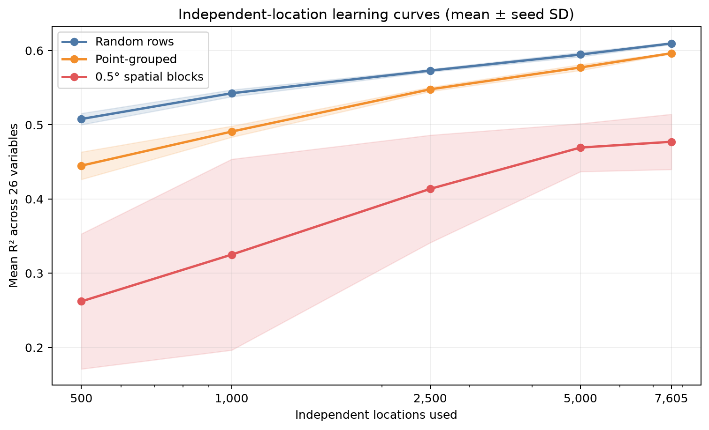
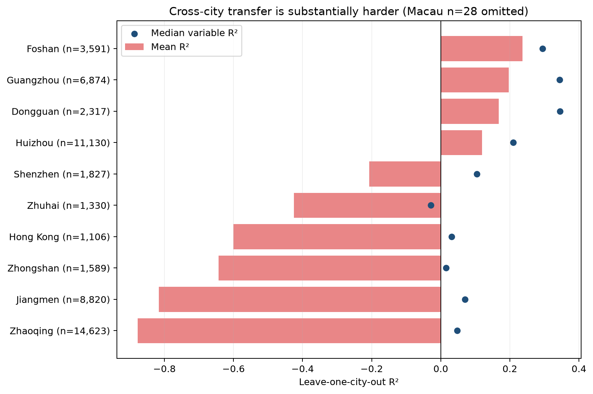
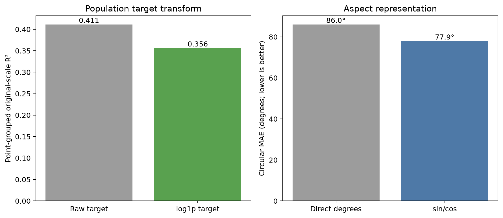

# AlphaEarth 大湾区实验质量增强报告

## 核心结论

本轮没有增加新的模型宣传指标，而是系统检查了位置泄漏、样本量、坐标混杂、跨城市外推、随机种子、静态变量重复和目标表示。结果表明：普通随机行验证确实偏乐观，但平均影响小于空间分块和跨城市迁移；独立位置增加仍能改善结果，但学习曲线后段已经明显变缓；AlphaEarth提供了超出坐标的信息，坐标与嵌入联合通常最好；模型对完整城市的外推明显不稳健。

质量审计使用轻量多输出随机森林作为统一控制模型，所有26个目标先按训练集标准化，使不同量纲在多输出树中权重接近。它用于比较实验设计，不替代此前逐变量50棵树的论文口径结果。

## 1. 同折公平基线

| 验证方式 | 模型 | 仅坐标 | 仅AlphaEarth | 坐标+AlphaEarth | 联合相对坐标增量 |
|---|---|---:|---:|---:|---:|
| Random rows | ridge | 0.404 | 0.601 | 0.681 | +0.277 |
| Random rows | random_forest | 0.637 | 0.601 | 0.728 | +0.092 |
| Point-grouped | ridge | 0.403 | 0.599 | 0.679 | +0.276 |
| Point-grouped | random_forest | 0.549 | 0.588 | 0.704 | +0.155 |
| 0.5° spatial blocks | ridge | 0.336 | 0.530 | 0.620 | +0.284 |
| 0.5° spatial blocks | random_forest | 0.366 | 0.478 | 0.597 | +0.231 |

最重要的判断不是哪个绝对分数最高，而是联合输入相对坐标基线的增量。在空间分块条件下，AlphaEarth仍提供额外信息，因此结果不能完全归因于经纬度；但坐标本身的预测能力也不可忽略。

## 2. 随机行、位置分组与空间分块

| 验证方式 | 三种子平均R² | 种子间标准差 |
|---|---:|---:|
| Random rows | 0.601 | 0.0002 |
| Point-grouped | 0.588 | 0.0002 |
| 0.5° spatial blocks | 0.478 | 0.0001 |

随机行与位置分组之间的差值衡量同地点跨年份泄漏，位置分组与空间分块之间的差值则主要反映空间自相关和区域外推难度。结果显示第二种差值更大，因此当前最主要的问题不是简单的年度重复，而是空间迁移。

## 3. 独立位置学习曲线

| 独立位置数 | 随机行R² | 位置分组R² | 空间分块R² |
|---:|---:|---:|---:|
| 500 | 0.508 ± 0.008 | 0.445 ± 0.018 | 0.262 ± 0.091 |
| 1,000 | 0.542 ± 0.005 | 0.491 ± 0.007 | 0.325 ± 0.129 |
| 2,500 | 0.573 ± 0.002 | 0.548 ± 0.003 | 0.414 ± 0.072 |
| 5,000 | 0.595 ± 0.003 | 0.577 ± 0.004 | 0.469 ± 0.032 |
| 7,605 | 0.610 ± 0.001 | 0.596 ± 0.001 | 0.477 ± 0.037 |

从500个位置增加到7,605个完整案例位置后，三种验证均有改善，但后段提升幅度变小。新增年份不能替代新增空间位置；如果继续扩展数据，优先扩大到广东省比继续重复相同位置更有价值。

## 4. 静态目标去重

高程、地形、土壤、树冠、建成区和人口等11个静态目标在完整数据中会被重复七年。比较结果：

| 数据与验证 | 静态变量平均R² |
|---|---:|
| 全部年份，随机行 | 0.473 |
| 全部年份，按point_id分组 | 0.451 |
| 仅2023年，随机行 | 0.440 |
| 仅2023年，空间分块 | 0.406 |

因此静态目标的主报告应优先采用单年或位置分组结果，全部年份随机CV只能作为与原论文对比的辅助口径。

## 5. 留一城市验证

| 留出城市 | 测试行数 | 26变量平均R² | 变量R²中位数 |
|---|---:|---:|---:|
| Dongguan | 2,317 | 0.168 | 0.345 |
| Foshan | 3,591 | 0.236 | 0.295 |
| Guangzhou | 6,874 | 0.197 | 0.344 |
| Hong Kong | 1,106 | -0.600 | 0.031 |
| Huizhou | 11,130 | 0.120 | 0.210 |
| Jiangmen | 8,820 | -0.816 | 0.070 |
| Macau | 28 | -3.846 | -0.593 |
| Shenzhen | 1,827 | -0.207 | 0.105 |
| Zhaoqing | 14,623 | -0.877 | 0.048 |
| Zhongshan | 1,589 | -0.643 | 0.015 |
| Zhuhai | 1,330 | -0.425 | -0.029 |

留一城市结果明显弱于0.5°空间分块。城市内部某些目标方差很小，使R²容易出现较大负值，特别是只有少量点的澳门，因此同时报告中位数和测试行数。总体结论仍然明确：当前模型适合区域内解释，不适合未经校准直接迁移到一个完全未见城市。

## 6. 目标变换

- 人口密度偏度为 **10.50**。训练目标使用 `log1p` 后，原始尺度R²由 **0.411** 变为 **0.356**，对数尺度R²由 **0.547** 变为 **0.683**。
- 坡向直接按角度预测的圆周MAE为 **86.0°**，改用正弦/余弦后为 **77.9°**。
- `flow_accumulation` 在提取阶段已经是 `log(cell count + 1)`，没有重复取对数。
- 夜间灯光和年径流在当前大湾区数据中偏度分别只有 **0.46** 和 **-0.13**，没有机械地增加对数变换。

## 7. 数据独立性与缺失

- 总行数：54,614；独立位置：7,802；26变量全部完整：53,235行。
- 有缺失的变量：flow_accumulation 0.28%, clay_fraction 2.42%, organic_carbon 2.42%, soil_ph 2.42%, water_capacity 2.42%, population_density 0.04%。
- 按ERA5-Land约0.1°原始网格估算，每年约覆盖 **593** 个源网格，每个源网格平均对应 **13.2** 个采样点。
- 将粗分辨率影像重投影到10m只会产生插值值，不会创造新的独立气候观测，因此气候和水文变量的有效样本量显著小于54,614。
- 土壤缺失没有被当作真实标签插补。对监督学习目标进行空间插补会制造伪标签，因此主分析继续采用逐变量删除或完整案例敏感性分析。

## 现在可以更可靠地回答的问题

1. **是否存在位置泄漏？** 有，但随机行与位置分组的差距小于空间分块损失。
2. **是否样本量不足？** 独立位置增加仍有效，但曲线后段趋缓；空间覆盖比重复年份更关键。
3. **AlphaEarth是否只是坐标代理？** 不是。空间分块下嵌入和联合输入仍优于仅坐标，但坐标混杂确实存在。
4. **能否跨城市直接部署？** 目前不能。完整城市留出结果明显不稳健。
5. **哪些处理应改入主流程？** 人口使用`log1p`作为补充口径，坡向使用正弦/余弦，静态目标采用位置分组或单年验证。

## 下一步

当前大湾区数据内部最重要的质量检查已经完成。若继续提高实验质量，下一项最有信息增益的工作是扩展到广东省，以增加独立位置和环境梯度；继续增加相同区域的模型复杂度或问答模板，收益会更低。
