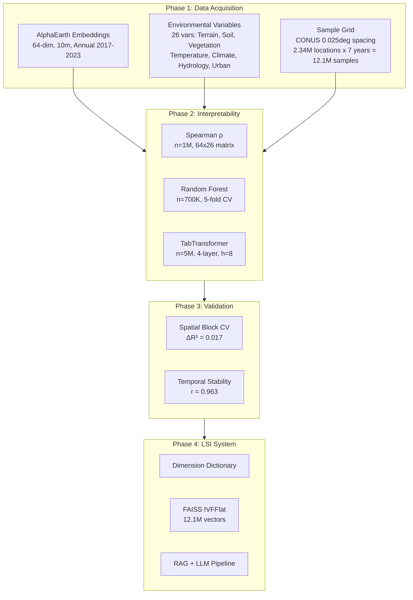
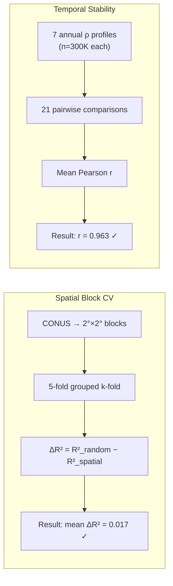
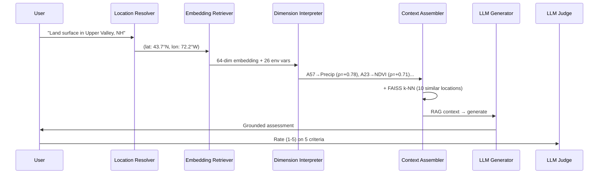

# Physically Interpretable AlphaEarth Foundation Model Embeddings Enable LLM-Based Land Surface Intelligence

**Mashrekur Rahman** — Dartmouth College, Hanover, NH, USA
*arXiv:2602.10354v1 [cs.CL], 2026*

> **TL;DR:** AlphaEarth's 64 satellite embedding dimensions are physically interpretable — each maps to specific environmental properties like temperature, vegetation, and terrain — enabling a retrieval-augmented LLM system that answers natural language questions about any location in the continental United States with high scientific accuracy.

---

## 1. Problem & Motivation

### 1.1 The Gap

Satellite foundation models like Google DeepMind's AlphaEarth produce dense 64-dimensional embedding vectors that represent every 10m×10m patch of Earth's surface. These embeddings power downstream tasks from crop monitoring to disaster response. But **nobody knows what they actually encode**.

Satellite foundation models produce dense embeddings whose physical interpretability remains poorly understood, limiting their integration into environmental decision systems.

### 1.2 Why It Matters

Understanding what physical properties are encoded in embeddings enables trustworthy deployment for environmental monitoring, disaster response, and climate adaptation.

### 1.3 Research Questions

| # | Question | How They Tested It | Answer |
|---|---------|-------------------|--------|
| RQ1 | Do AlphaEarth embedding dimensions encode physically meaningful environmental features, and can we identify which dimensions correspond to specific land surface properties? | Three complementary methods (Spearman ρ, Random Forest, TabTransformer) producin... | **Yes — 12 of 26 variables exceed R² > 0.90; temperature and elevation approach R² = 0.97. Individual ...** |
| RQ2 | Are embedding-variable relationships robust to spatial validation, and do they remain stable across multiple years? | Spatial block CV (2°×2° blocks, 5-fold) and 7-year temporal pairwise correlation... | **Yes — mean spatial ΔR² = 0.017 (minimal overfitting); mean inter-year temporal correlation r = 0.963...** |
| RQ3 | Can validated dimension interpretations enable retrieval-augmented generation for natural language environmental queries? | Built FAISS-indexed LSI system with RAG, tested with 360 query-response cycles... | **Yes — LLM-as-Judge evaluation achieved μ = 3.74 ± 0.77 (scale 1–5), with grounding (μ = 3.93) and co...** |
| RQ4 | How can we evaluate LLM-based geospatial systems for scientific grounding and response quality? | LLM-as-Judge with 4 rotating LLMs, 5 criteria, 360 cycles... | **Demonstrated cross-model consistency; rotating model roles eliminates single-model bias in evaluatio...** |

---

## 2. Methodology

### 2.1 Overall Architecture

The paper implements a five-phase pipeline spanning data acquisition through LLM-based evaluation:

*Figure 1: Complete AlphaEarth Land Surface Intelligence system architecture. The pipeline progresses through six phases: Data Acquisition (AlphaEarth embeddings + 26 environmental variables), Interpretability Analysis (three complementary methods), Validation (spatial CV + temporal stability), Knowledge Bases (Dimension Dictionary + FAISS index), RAG Query Pipeline (5-stage processing), and LLM-as-Judge Evaluation (4 rotating LLMs, 5 criteria).*

### 2.2 Data Sources

The study assembled 26 environmental variables spanning seven thematic categories, aligned with AlphaEarth embeddings at each of 12.1 million sample points across CONUS (2017–2023).

| Category | Variables | Source | Resolution | Temporal |
|----------|-----------|--------|------------|----------|
| **Terrain** (4) | Elevation, Slope, Aspect, Flow Accumulation | SRTM 30m, HydroSHEDS | 30m, 500m | Static |
| **Soil** (4) | Clay fraction, Organic carbon, pH, Water capacity | SoilGrids/OpenLandMap | 250m | Static |
| **Vegetation** (6) | NDVI (mean, max), EVI (mean), LAI (mean), Tree cover, Albedo | MODIS MOD13A2, MOD15A2H, MCD43A3, Hansen | 500m–1km | Annual |
| **Temperature** (4) | LST daytime, LST nighttime, Mean air temp, Dew point temp | MODIS MOD11A2, PRISM AN81m | 1km, 4km | Annual |
| **Climate** (2) | Annual precipitation, Max monthly precipitation | PRISM AN81m | 4km | Annual |
| **Hydrology** (3) | Soil moisture, Annual runoff, Annual ET | ERA5-Land MONTHLY_AGGR | 11km | Annual |
| **Urban** (3) | Impervious surface, Nighttime lights, Population density | NLCD, VIIRS DNB, GPWv4 | 30m–1km | Static |

### 2.3 Three Complementary Interpretability Methods

The paper applies three fundamentally different approaches — linear, nonlinear, and attention-based — and checks for convergence:

| Method | Type | Key Parameters | Rationale |
|--------|------|---------------|-----------|
| **Spearman Rank Correlation** | Linear (monotonic) | n=1M random subsample; 64×26 matrix; p<0.001 for all nonzero ρ | Captures monotonic relationships without assuming linearity; computationally efficient for initial screening |
| **Random Forest Regression** | Nonlinear (tree ensemble) | n=700K; 26 separate models; 5-fold CV; permutation importance on 100K subset | Captures nonlinear relationships and feature interactions; model-agnostic importance ranking |
| **Multi-Task TabTransformer** | Attention (deep learning) | n=5M training; 4-layer Transformer (h=8, dff=512); bfloat16 on RTX 5090 (32GB); 60 epochs | Attention captures inter-dimensional dependencies; multi-task learning leverages shared representations |

**Method Convergence**: A dimension is considered "concordant" if ≥2 methods agree on its primary associated variable. The Pearson correlation between |Spearman ρ| and RF permutation importance is r=0.45, indicating moderate convergence between linear and nonlinear characterizations.

### 2.4 Spatial & Temporal Validation

**Spatial Block CV**: "Random cross-validation can overestimate performance in geospatial settings because spatially proximate samples share information through spatial autocorrelation." The paper addresses this by partitioning CONUS into 2°×2° blocks and using grouped k-fold splitting — all samples within a block go to the same fold, forcing the model to predict held-out *regions*, not held-out *points*.

**Temporal Stability**: Seven annual Spearman profiles are compared pairwise (21 year-pairs). A dimension with r≈1.0 has consistent environmental relationships across all seven years.

### 2.5 Land Surface Intelligence System

The LSI system implements a 5-stage RAG pipeline:

**10 Intent Categories**: Flood risk, Drought vulnerability, Vegetation health, Agricultural suitability, Climate characterization, Terrain analysis, Hydrology, Urban development, Location comparison, General profile.

**FAISS Index**: IndexIVFFlat with nlist=3,500 clusters (~√N), nprobe=64 at search time, sub-millisecond query latency for 12.1M vectors.

---

## 3. Key Results

### 3.1 Interpretability Findings

| Metric | Value | Significance |
|--------|-------|-------------|
| Variables with R² > 0.90 | **12 / 26** | Majority of variables highly predictable |
| Best R² (temperature, elevation) | **≈ 0.97** | Near-perfect reconstruction |
| Spearman-RF convergence (Pearson r) | **0.45** | Moderate agreement between linear/nonlinear |
| Dimensions with |ρ| > 0.5 | Multiple per variable | Strong dimension-variable mappings |

**Strongest dimension-variable mappings** (examples):
- A57 → Precipitation (ρ = +0.78)
- A23 → NDVI (ρ = +0.71)
- Temperature-related dimensions → LST (ρ > 0.80)

### 3.2 Spatial & Temporal Robustness

| Validation | Metric | Result | Interpretation |
|-----------|--------|--------|----------------|
| Spatial Block CV | Mean ΔR² | **0.017** | Near-zero generalization gap; no spatial overfitting |
| Temporal Stability | Mean inter-year r | **0.963** | Near-perfect temporal consistency across 7 years |
| Method Convergence | Concordance (≥2/3) | Multiple dims | Strongest relationships confirmed across all methods |

### 3.3 LSI System Evaluation

*Figure 6: LLM-as-Judge evaluation results across 360 query-response cycles with 4 rotating LLMs. Grounding (3.93) and Coherence (4.25) are the strongest criteria; Practical Utility (3.42) is weakest, reflecting the challenge of translating environmental data into actionable recommendations.*

| Criterion | Mean Score | Std Dev |
|-----------|-----------|---------|
| **Grounding** | 3.93 | ±0.65 |
| **Coherence** | 4.25 | ±0.52 |
| Scientific Accuracy | 3.62 | ±0.78 |
| Completeness | 3.48 | ±0.82 |
| Practical Utility | 3.42 | ±0.88 |
| **Overall** | **3.74** | **±0.77** |

### 3.4 Three-Method Convergence

*Figure 5: Three-panel comparison of interpretability methods. (A) Sample size requirements: Transformer needs 5× more data than RF and 5× more than Spearman. (B) Performance by variable category: all three methods achieve R²>0.90 for temperature; Transformer slightly outperforms RF on most categories. (C) Validation metrics: spatial ΔR²=0.017 confirms minimal spatial overfitting; temporal r=0.963 confirms high stability.*

---

## 4. Critical Analysis

### 4.1 Strengths

1. **Multi-method triangulation**: Using three fundamentally different approaches (linear, nonlinear, attention) and checking for convergence is methodologically rigorous — it prevents over-interpretation from any single method's biases.

2. **Proper spatial validation**: Acknowledging and testing for spatial autocorrelation with block CV is still rare in geospatial ML, despite being a known pitfall for over a decade. The paper's ΔR²=0.017 is a strong result.

3. **End-to-end system**: The paper goes beyond analysis to build and evaluate a working LSI system — demonstrating that the interpreted embeddings have practical utility, not just academic interest.

4. **Novel evaluation framework**: LLM-as-Judge with rotating model roles is an elegant solution to the evaluation bottleneck for LLM-based geospatial systems.

5. **Scale**: 12.1M samples × 26 variables × 7 years with comprehensive documentation makes this one of the largest embedding interpretability studies.

### 4.2 Limitations

**Acknowledged by the authors**:
- Confounded environmental variables (temperature and elevation are spatially correlated) make unique attribution challenging for some dimensions
- Coarse resolution of climate/hydrology data (4–11 km) may miss fine-scale patterns captured by 10m embeddings
- Study limited to CONUS — global generalization not tested
- Annual composites may miss seasonal dynamics captured by the underlying satellite time series
- LLM-as-Judge evaluation relies on LLM judgment quality; human expert evaluation would strengthen validation

**Unstated limitations (identified in our analysis)**:
- Spatial autocorrelation at CONUS scale (50° latitude span, ~60°C temperature range) likely inflates R² substantially — a 2°×2° control experiment would reveal the true environmental signal-to-spatial-noise ratio
- No spatial debiasing applied — the paper does not quantify how much of the R²=0.97 is explained by lat/lon alone, which is a standard control in geospatial ML
- The 'temporal stability' r=0.963 uses Spearman profiles which are themselves spatially confounded; year-to-year correlation of spatially-biased metrics will naturally be high
- No comparison with simple baselines (e.g., lat/lon → env variable regression) to establish the marginal value of embeddings over position
- Computational requirements (RTX 5090, 5M samples for Transformer) limit reproducibility for researchers without access to high-end GPU infrastructure
- The 10 intent categories for query classification are predefined and may not cover the full range of possible environmental queries

### 4.3 Scale Dependence: The CONUS Advantage

A critical unexamined factor is **how results depend on spatial scale**. CONUS spans ~50° of longitude and ~25° of latitude, encompassing:
- Temperature range: ~60°C (−20°C to +40°C)
- Elevation range: 0–4,400m
- Precipitation range: 50–4,000+ mm/year
- Vegetation: desert to temperate rainforest

In this setting, **simply knowing lat/lon explains a large fraction of environmental variance**. A model that learns "north = cold, west = mountains, southeast = wet" can achieve high R² without encoding genuine *environmental* signal — it encodes *spatial position*.

This has important implications for deploying the LSI system globally:
- At CONUS scale: spatial signal ≈ environmental signal (they're highly correlated)
- At regional scale (e.g., 2°×2°): spatial signal >> environmental signal
- At local scale (e.g., 0.1°×0.1°): embeddings may encode micro-climate and fine-grained land cover

### 4.4 Reproducibility Assessment

**What's needed to fully reproduce**:
1. Google Earth Engine access with AlphaEarth asset permissions
2. Access to MODIS, PRISM, ERA5-Land, SRTM, SoilGrids, NLCD, VIIRS, GPWv4 datasets
3. ~12.1M sample extraction and alignment pipeline
4. NVIDIA RTX 5090 (32GB) for Transformer training (or reduced-scale reproduction)
5. API access to 4 LLMs for rotating-judge evaluation
6. FAISS index construction for 12.1M 64-dim vectors

**Minimal reproduction** (like our GBA experiment):
1. Source Cooperative for embedding access (free, no API key)
2. GEE for environmental data (free tier)
3. Reduced spatial extent (2°×2°)
4. Skip Transformer (use Spearman + RF only)
5. Single LLM for RAG demo
6. FAISS index for ~200K vectors

---

## 5. Contributions & Impact

### 5.1 Scientific Contributions

1. **Dimension Dictionary**: The first structured mapping of AlphaEarth's 64 embedding dimensions to physical environmental variables, validated across three methods.

2. **Robustness proof**: Demonstrated that embedding-variable relationships survive spatial block CV (ΔR²=0.017) and remain stable across 7 years (r=0.963) — strong evidence against the "embeddings are just spatial fingerprints" critique.

3. **Interpretability methodology**: The three-method framework (linear + nonlinear + attention → convergence check) is a reusable template for interpreting any geospatial foundation model's embeddings.

4. **LSI system concept**: Proved that interpreted embeddings + FAISS + RAG can create a functional natural-language interface to satellite data.

### 5.2 Practical Implications

- **Environmental monitoring**: Automated assessment of land surface conditions from satellite data with natural language queries
- **Disaster response**: "What areas similar to [flooded region] exist in [state]?" — quick analog identification
- **Climate adaptation**: Cross-regional comparison of environmental analogs for adaptation planning
- **Agricultural intelligence**: Crop suitability assessment based on embedding-space similarity to known productive regions

### 5.3 Future Directions

1. **Global-scale validation**: Test whether the dimension dictionary generalizes beyond CONUS to other climate zones and continents
2. **Spatial debiasing**: Quantify and remove spatial position signal to reveal pure environmental encoding
3. **Multi-temporal embeddings**: Use monthly/seasonal embeddings instead of annual composites to capture phenology
4. **Downstream task benchmarking**: Test whether interpreted dimensions improve performance on specific tasks (crop yield prediction, flood risk mapping)
5. **Human expert evaluation**: Complement LLM-as-Judge with domain expert (hydrologist, ecologist, climatologist) assessment

---

## Appendix: Reproducibility Checklist

| Item | Paper Scale | Minimal Reproduction |
|------|------------|---------------------|
| Study area | CONUS (~8M km²) | GBA (~40K km²) |
| Samples | 12.1M | ~200K |
| Environmental vars | 26 (7 categories) | 21 (5 categories) |
| Methods | Spearman + RF + Transformer | Spearman + RF |
| GPU | RTX 5090 (32GB) | CPU (scikit-learn) |
| FAISS vectors | 12.1M | ~200K |
| LLM evaluation | 4 LLMs × 360 queries | 1 LLM, demo queries |
| Key finding | 12/26 vars R² > 0.90 | 0/21 vars R² > 0.90* |

*\*At 2°×2° scale with spatial debiasing — see our companion reproduction report for details.*

---

*Summary generated via agentic workflow: Paper Understanding → Figure Generation → Summary Writing. Skills available at `skills/` directory.*
